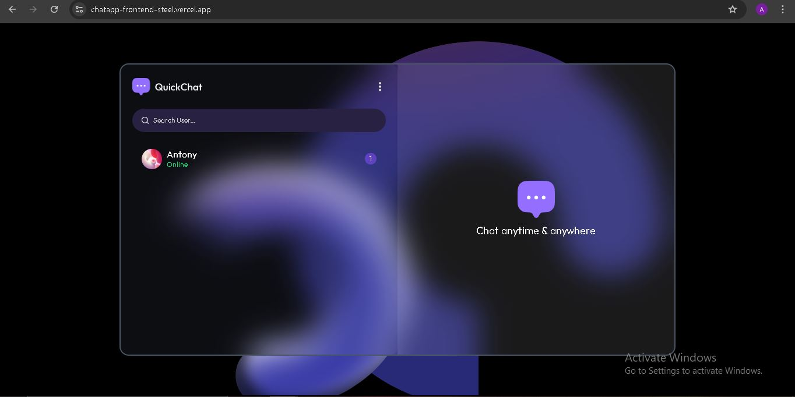
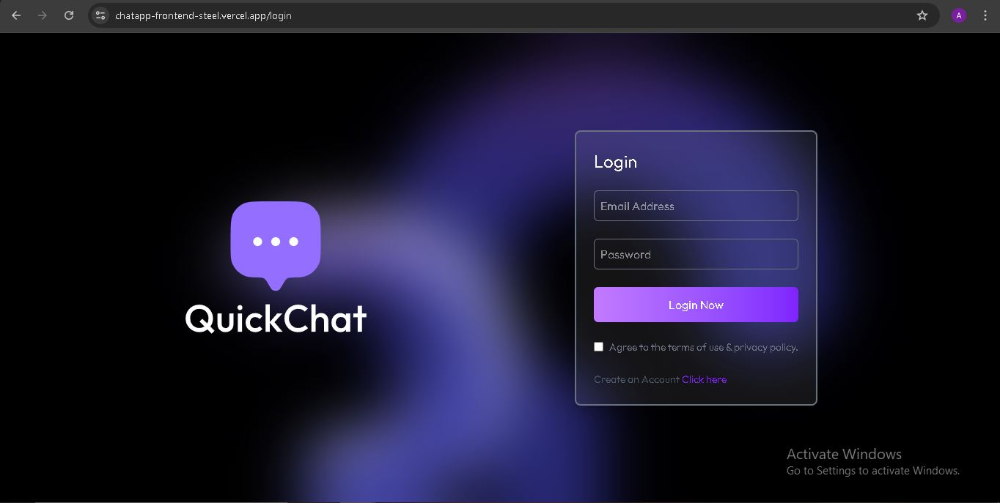
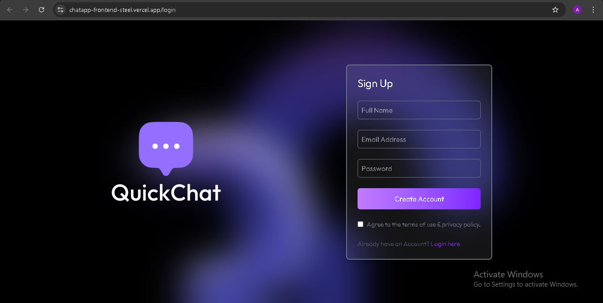
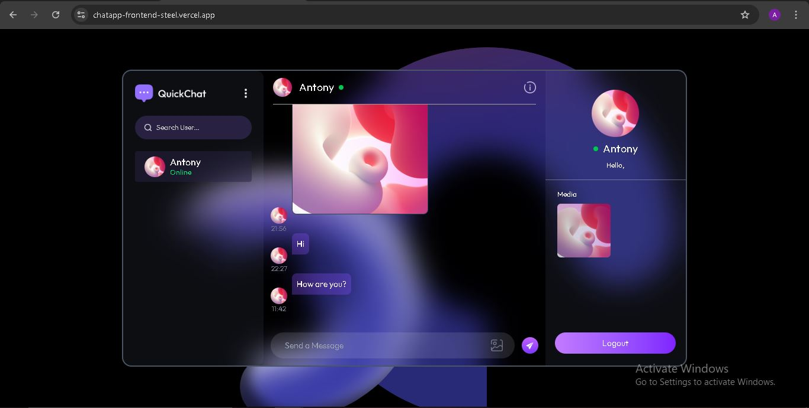
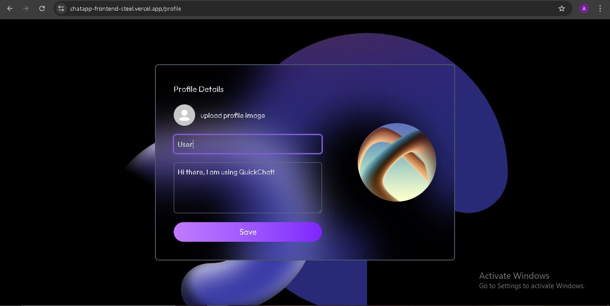

# 🗨️ ChatApp – Real-Time Chat Application

ChatApp is a **real-time messaging application** built with the **MERN stack** (MongoDB, Express, React, Node.js). It allows users to engage in instant text-based communication, featuring private and group chats, user authentication, and a responsive user interface.

---

## 🚀 Live Demo

Experience the application live:  
👉 [chatapp-frontend-steel.vercel.app](https://chatapp-frontend-steel.vercel.app)

---

## 📦 Features

### 🔐 User Authentication
- Sign Up / Login with JWT tokens
- Session management for persistent login

### 💬 Real-Time Messaging
- Private chats between users
- Group chats with multiple participants
- Real-time notifications for new messages

### 🖼️ Media Sharing
- Share images in chats
- Send/receive various file types

### 🛠️ Admin Panel
- User management for admins
- Chat moderation tools

---

## 🧱 Tech Stack

| Layer             | Technology                          |
|------------------|-------------------------------------|
| **Frontend**      | React, Socket.IO, TailwindCSS       |
| **Backend**       | Node.js, Express, Socket.IO         |
| **Database**      | MongoDB (Mongoose ODM)              |
| **Authentication**| JWT (JSON Web Tokens)               |
| **Hosting**       | Vercel (Frontend), Render (Backend) |

---

## 🖼️ Screenshots / UI Preview

### Home Page

### Login Page

### Sign-Up Page

### Chat Interface

### Profile Edit Page

